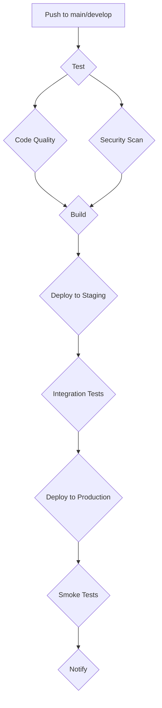

# GitHub Actions CI/CD Demo

This project is a demonstration of a complete Continuous Integration and Continuous Deployment (CI/CD) pipeline for a Node.js application using GitHub Actions. It showcases best practices for automating the build, test, and deployment processes, ensuring code quality and security.

## Features

- **Continuous Integration (CI):**
  - Automated testing on multiple Node.js versions.
  - Code linting and static analysis to enforce code quality.
  - Vulnerability scanning to identify security risks.
  - Test coverage reports to measure code testability.
- **Continuous Deployment (CD):**
  - Automated deployment to staging and production environments.
  - Docker containerization for consistent and portable deployments.
  - Health checks to ensure application availability.
- **Node.js Application:**
  - A simple Express.js application with a few API endpoints.
  - Unit and integration tests using Jest and Supertest.

## Technologies Used

- **Application:** Node.js, Express.js
- **Testing:** Jest, Supertest
- **CI/CD:** GitHub Actions
- **Containerization:** Docker
- **Code Quality:** ESLint
- **Security:** Trivy

## Getting Started

To get a local copy up and running, follow these simple steps.

### Prerequisites

- Node.js (v18.x or later)
- npm
- Docker

### Installation

1.  Clone the repo
    ```sh
    git clone https://github.com/your_username/github-actions-cicd-demo.git
    ```
2.  Install NPM packages
    ```sh
    npm install
    ```
3.  Run the application
    ```sh
    npm start
    ```
4.  Run the tests
    ```sh
    npm test
    ```

## CI/CD Pipeline

The CI/CD pipeline is defined in the `.github/workflows/cicd.yml` file and consists of the following jobs:



- **Test:** Runs unit tests on multiple Node.js versions.
- **Code Quality:** Performs static analysis using ESLint.
- **Security Scan:** Scans for vulnerabilities using Trivy.
- **Build:** Builds the Docker image and pushes it to the container registry.
- **Deploy to Staging:** Deploys the application to a staging environment.
- **Integration Tests:** Runs integration tests against the staging environment.
- **Deploy to Production:** Deploys the application to the production environment.
- **Smoke Tests:** Runs smoke tests against the production environment.
- **Notify:** Sends a notification about the deployment status.

## API Endpoints

| Method | Endpoint     | Description                                |
| ------ | ------------ | ------------------------------------------ |
| GET    | `/`          | Returns a welcome message.                 |
| POST   | `/calculate` | Calculates the sum of an array of numbers. |
| GET    | `/health`    | Returns the application status.            |

### POST /calculate

**Request Body:**

```json
{
  "numbers": [1, 2, 3, 4, 5]
}
```

**Response:**

```json
{
  "numbers": [1, 2, 3, 4, 5],
  "sum": 15,
  "isEven": false
}
```

## Project Structure

```
.
├── .github/workflows/cicd.yml
├── Dockerfile
├── package.json
├── src/
│   ├── app.js
│   └── utils.js
└── tests/
    ├── app.test.js
    └── utils.test.js
```
